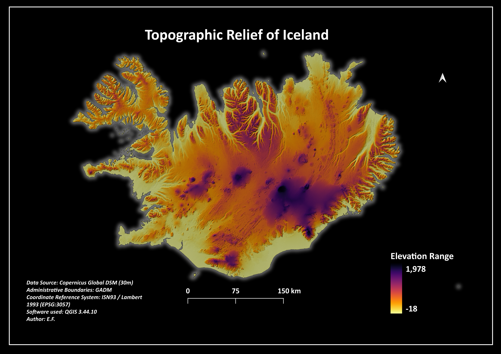

# Iceland Topographic Relief & Digital Elevation Model (DEM) Project

This repository features a comprehensive terrain visualization and spatial analysis workflow for Iceland. The project handles high-latitude conic reprojections, volcanic relief rendering, and professional "Dark Mode" cartographic styling.

## Project Preview


🛒 [Get the full high-quality GIS bundle on Payhip](https://payhip.com/b/vKRbN)

## Repository Structure
```text
├── 01_Maps_Print_Ready/   # High-quality 300 DPI exported layouts (Volcanic Dark Mode)
├── 02_Geospatial_Data/     # Clipped 30m GeoTIFF DEM & national vectors
└── 03_QGIS_Styling/       # Custom .qml layer style file (Inverted Magma setup)
